# Story Agents Architecture

## Overview

The story system uses a multi-agent architecture where specialized agents coordinate to create coherent, engaging interactive stories. Each agent has a specific role in either initializing stories or handling user interactions with continuous feedback mechanisms.

## Agent Roles

### 🎮 [StoryService](../backend/src/story/storyService.ts)
**Main Coordinator** - Orchestrates all story agents and manages the complete story lifecycle. Handles both initialization and user interaction flows while ensuring optimal performance through background operations.

### 🎬 [StoryInitializer](../backend/src/story/storyInitializer.ts) 
**Story Foundation Creator** - Establishes the core story framework using Aristotelian principles. Creates the fundamental StoryModel with theme, genre, setting, protagonist definition, conflicts, and intended impact.

### 🔮 [StoryPredictor](../backend/src/story/storyPredictor.ts)
**Future Planning & Feedback** - Plans story progression and provides continuous feedback to maintain narrative coherence. Uses advanced storytelling techniques and psychological narrative design to adapt the story based on user interactions.

### 🔧 [StoryOptimizer](../backend/src/story/storyOptimizer.ts)
**Emotional Rhythm Control** - Manages story pacing using sinusoidal emotional patterns. Controls when events happen and signals chapter transitions based on climax patterns.

### 🎭 [StoryNarrator](../backend/src/story/storyNarrator.ts)
**Response Generation** - Creates immersive narrative responses and meaningful user choices. Brings the story to life with engaging narration that follows optimizer instructions.

### 📚 [ChapterManager](../backend/src/story/chapterManager.ts)
**Chapter State Management** - Handles chapter transitions and organizes chapters by status (history, current, future). Manages the progression through the story timeline.

## Story Initialization Flow

```mermaid
graph TD
    A["🮠StoryService<br/>Main Coordinator"] --> B["🬠StoryInitializer<br/>Creates story foundation"]
    
    B --> B1["ğŸ—„ï¸ Database<br/>StoryModel Creation"]
    B --> B2["StoryModel Components:<br/>• Core theme & moral message<br/>• Genre, style & narrative voice<br/>• Setting constraints & world rules<br/>• Protagonist definition<br/>• Primary conflict sources<br/>• Intended emotional impact"]
    
    B1 --> C["🔮 StoryPredictor<br/>Plans future chapters"]
    B2 --> C
    
    C --> C1["ğŸ—„ï¸ Database<br/>Chapter Creation"]
    C --> C2["Future Chapters Generated:<br/>• Chapter titles<br/>• Detailed descriptions<br/>• Story progression roadmap<br/>• Complete narrative arc"]
    
    C1 --> D["📚 ChapterManager<br/>Manages chapter states"]
    C2 --> D
    
    D --> D1["ğŸ—„ï¸ Database<br/>Chapter Status Management"]
    D --> D2["Chapter Organization:<br/>• Set first chapter as 'current'<br/>• Store remaining as 'future'<br/>• Initialize chapter flow<br/>• Ready for user interaction"]
    
    D1 --> E["✅ Session Ready<br/>Story fully initialized<br/>User can begin adventure"]
    D2 --> E
    
    style A fill:#e1f5fe
    style B fill:#f3e5f5
    style C fill:#e8f5e8
    style D fill:#fff3e0
    style E fill:#c8e6c9
```

**Process:**
1. **StoryInitializer** creates comprehensive StoryModel with 6 core components
2. **StoryPredictor** generates initial chapter roadmap for complete story arc
3. **ChapterManager** organizes chapters and sets up initial state for user interaction

## User Interaction Flow

```mermaid
graph TD
    A["👤 User Input"] --> B["🎮 StoryService<br/>Main Coordinator"]
    
    B --> C["📚 ChapterManager<br/>Get Current Context"]
    C --> C1["Retrieved Context:<br/>• Current chapter details<br/>• Chapter message history<br/>• Recent session messages"]
    
    C1 --> D["🔧 StoryOptimizer<br/>Emotional Rhythm Analysis"]
    D --> D1["Optimizer Analysis:<br/>• Sinusoidal pacing patterns<br/>• Emotional intensity tracking<br/>• Story beat decomposition<br/>• Chapter transition signals"]
    
    D1 --> E["🎭 StoryNarrator<br/>Generate Response"]
    E --> E1["Narrative Creation:<br/>• Immersive storytelling<br/>• Following optimizer guidance<br/>• Generate user choices<br/>• Create engaging response"]
    
    E1 --> F["🔮 StoryPredictor<br/>Single Feedback Loop"]
    F --> F1["Complete Analysis:<br/>• User input + narrator response<br/>• Story trajectory assessment<br/>• Chapter coherence check<br/>• Future planning updates"]
    
    F1 --> G["📱 Response Delivered<br/>Immediate User Experience"]
    G --> G1["User Receives:<br/>• Story narrative<br/>• 3 meaningful choices<br/>• Instant interaction"]
    
    G1 --> H["🏃‍♂️ Background Operations<br/>(ExecutionContext)"]
    H --> H1["Store Messages:<br/>• User input saved<br/>• Narrator response saved<br/>• Message persistence"]
    
    H1 --> I["📝 Apply Story Updates"]
    I --> I1["Update Components:<br/>• Current chapter modifications<br/>• Future chapters adjustments<br/>• Story consistency maintained"]
    
    I1 --> J["🔄 Chapter Transition<br/>(If Signaled)"]
    J --> J1["Transition Process:<br/>• Move current → history<br/>• Next future → current<br/>• Update chapter states<br/>• Maintain story flow"]
    
    J1 --> K["✅ Cycle Complete<br/>Ready for Next Interaction"]
    
    style A fill:#ffeb3b
    style B fill:#e1f5fe
    style C fill:#fff3e0
    style D fill:#f3e5f5
    style E fill:#fce4ec
    style F fill:#e8f5e8
    style G fill:#c8e6c9
    style H fill:#f0f4c3
    style I fill:#e1f5fe
    style J fill:#e0f2f1
    style K fill:#c8e6c9
```

**Sequential Process:**
1. **User Input** triggers the story interaction flow
2. **StoryService** coordinates all agents and manages the process
3. **ChapterManager** retrieves current context and message history
4. **StoryOptimizer** analyzes emotional pacing and determines story beats
5. **StoryNarrator** generates immersive response with user choices
6. **StoryPredictor** performs single feedback loop with complete interaction context
7. **Response Delivered** immediately to user for optimal experience
8. **Background Operations** handle database persistence and story updates
9. **Chapter Transition** occurs if signaled by optimizer
10. **System Ready** for the next user interaction

## Key Features

### Continuous Feedback Loop
The **StoryPredictor** continuously analyzes user interactions to refine the story, ensuring narrative coherence while adapting to user choices. This "greedy optimization" approach follows the most engaging path revealed by user interactions.

### Sinusoidal Pacing
The **StoryOptimizer** uses emotional rhythm patterns (Introduction → Rising → Climax → Resolution → Transition) to create satisfying story beats and determine optimal chapter transition points.

### Performance Optimization
The system uses **ExecutionContext** for background operations, ensuring users receive immediate responses while database operations and chapter transitions happen asynchronously.

### Data Structures

The agents work with key data structures defined in [`db-types.ts`](../backend/src/database/db-types.ts):

- **StoryModel**: Core story framework with theme, genre, setting, conflicts
- **Chapter**: Individual story segments with status tracking (history/current/future)  
- **Message**: User and narrator interactions within chapters
- **Session**: Links users to their active story worlds

## Utilities

The system uses shared utilities in [`mpcUtils.ts`](../backend/src/story/mpcUtils.ts) for parsing AI responses and extracting structured data from natural language outputs. 